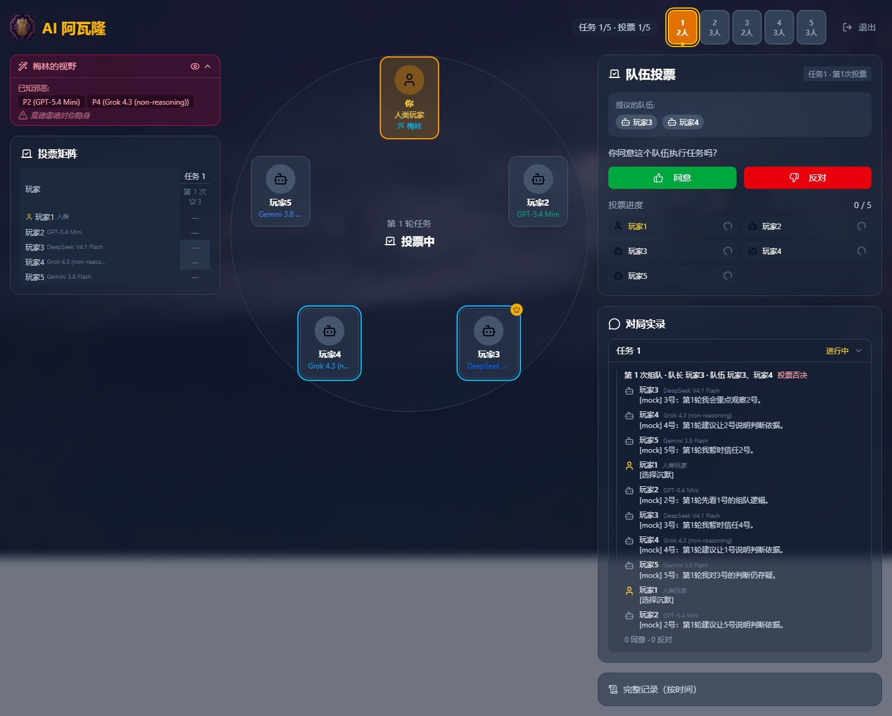

# avalon-ai

LLM agents playing *The Resistance: Avalon*. Two things live in this repo:

1. A playable web version at **https://ai-avalon.com**: you take one seat, the other seats are filled by models from five providers (Anthropic, OpenAI, Google, DeepSeek, xAI) that discuss, vote, run quests, and try to assassinate Merlin. The UI is currently in Chinese.
2. A headless batch pipeline and a frozen dataset of **140 five-player, AI-only games** across 9 configurations, built to reproduce the setup of Lan et al., *LLM-Based Agent Society Investigation: Collaboration and Confrontation in Avalon Gameplay* (EMNLP 2024), with April-2026 models.

Both share the same TypeScript game engine (`lib/game/`), provider dispatch (`lib/ai/`), and prompt builders (`lib/security/aiPromptTemplate.ts`).



## Result

Per-config evil-side win rate over the frozen dataset (`python analysis/stats.py`, Wilson 95% CIs, n = games):

| Config | Models | Prompt | n | Evil win % [95% CI] |
|---|---|---|---|---|
| homogeneous-gpt4o (label; runs gpt-5.4-mini) | gpt-5.4-mini ×5 | full | 15 | 46.7 [24.8, 69.9] |
| homogeneous-gpt-naive | gpt-5.4-mini ×5 | naive | 15 | 93.3 [70.2, 98.8] |
| homogeneous-claude | claude-sonnet-4-6 ×5 | full | 15 | 73.3 [48.0, 89.1] |
| homogeneous-claude-naive | claude-sonnet-4-6 ×5 | naive | 15 | 73.3 [48.0, 89.1] |
| heterogeneous-full | one seat per provider | full | 20 | 95.0 [76.4, 99.1] |
| heterogeneous-naive | one seat per provider | naive | 15 | 80.0 [54.8, 93.0] |
| homogeneous-gemini | gemini-2.5-flash ×5 | full | 15 | 86.7 [62.1, 96.3] |
| homogeneous-deepseek | deepseek-chat ×5 | full | 15 | 46.7 [24.8, 69.9] |
| homogeneous-grok | grok-4-fast-non-reasoning ×5 | full | 15 | 86.7 [62.1, 96.3] |

Matched full-vs-naive pairs, two-sided two-proportion z-test on evil win rate (unit = game):

| Pair | full | naive | z | p |
|---|---|---|---|---|
| gpt-5.4-mini | 7/15 | 14/15 | −2.79 | 0.0053 |
| claude-sonnet-4-6 | 11/15 | 11/15 | 0.00 | 1.0000 |
| heterogeneous | 19/20 | 12/15 | 1.38 | 0.1675 |

"Full" prompts include explicit strategy guidance (evil: hide your identity, express concern for quest success; Merlin: hide your knowledge). "Naive" prompts give only role, vision, and game state. Everything else, including the engine, models, and parsing, is identical between the two arms.

Interpretation. Lan et al. report evil winning 100% and good 90% of games with their six-module agent pipeline, and describe evil agents' camouflage (voting for early quest success before sabotaging) as emergent strategic behaviour. In this reproduction, with a single-call prompt per decision, GPT-5.4 mini's evil side wins 46.7% of games under the full prompt and 93.3% under the naive prompt (p = 0.005); Claude Sonnet 4.6's evil side wins 73.3% under both. The balance the paper attributes to the agents is here a property of the prompt for one model and absent for another. That is the sense in which the headline result reverses: in this setting the strategic behaviour is prompt-induced, not model-intrinsic.

Limits. Only the GPT pair is statistically significant. n = 15 per arm, so the confidence intervals are wide. The heterogeneous pair moves in the other direction and is not significant. Nine tests were run without correction (three pairs × three metrics); the GPT evil-win result survives a Bonferroni threshold of 0.0056 by a small margin. Generation parameters differ by provider (see `analysis/config_map.md`), which confounds cross-model comparisons but not the within-model full-vs-naive pairs.

## Known data issues

- **`quests[].round` and `quests[].result` are unreliable.** A logger bug in `scripts/batch.ts` (fixed after collection) copied `round` and sometimes `result` from an earlier quest whenever the same ordered team was sent again. 144 of 564 quest records in 95 of 140 games carry a wrong `round`; 57 records in 40 games carry a wrong `result`. Derive round as array index + 1 and result from `actions` (any `"fail"` means failure). `winner`, `winReason`, `teamProposals`, `votes`, and `actions` are correct, so the win-rate results above are unaffected. Per-round sabotage tables in `results/` and `analysis/camouflage.md` were computed from the logged `round` and should be treated as indicative only.
- **200 discussion lines in 6 games are provider-failure placeholder text.** The dispatch layer used at collection time substituted a canned sentence when a provider call failed, and the logger counted it as real speech (`fallbackCounts.discussion` is 0 for these games). Affected games: `1776475634724-9z2vb` (homogeneous-gpt4o, 1 line), `1776646896365-2cv59` (homogeneous-grok, 2 lines), `1776649155738-ais08`, `1776649155703-stwqx`, `1776651068022-3vknq`, `1776650983216-8l59c` (homogeneous-gemini, 44–60 lines each, 26–50% of their dialogue). Recounted on 2026-09-22 against all 11 placeholder strings that the original dispatch, validator, and client code could emit (commit `4d97610`): 200 exact matches, 6 games, no partial matches. The placeholder path has since been removed (provider failures now surface as errors), but the dataset is frozen as collected. Votes and quest actions produced by the same failure path cannot be identified after the fact.
- **Unequal n.** heterogeneous-full has 20 games; every other config has 15.
- Config label `homogeneous-gpt4o` predates a model update and runs `gpt-5.4-mini`, not GPT-4o. The exact model strings per config, with collection dates, are in `analysis/config_map.md`.

## Repository layout

| Path | What it is |
|---|---|
| `app/`, `components/` | Next.js web app (one human seat plus AI seats; lobby default is 10 players, 5–10 supported) |
| `lib/game/` | Game engine (state machine, roles, vision) shared by the app and the batch runner |
| `lib/ai/dispatch.ts` | Provider dispatch (Anthropic/OpenAI/Google/DeepSeek/xAI), timeouts, retries, typed failure results |
| `lib/security/` | Prompt templates (full/naive modes) and input/output validators |
| `scripts/` | Batch runner (`batch.ts`), the 9 configs (`configs.ts`), report generator (`metrics.ts`), provider smoke test (`smoke.ts`). See `scripts/README.md` |
| `data/games.jsonl` | The dataset: 140 games, one JSON object per line. Frozen; do not regenerate in place |
| `results/` | Committed output of `npm run metrics` |
| `analysis/` | Post-hoc analysis: `stats.py` (CIs, z-tests), `camouflage.ts`, `annotate_selfrec.ts` (LLM judge), `config_map.md` |
| `docs/` | Supporting notes, including the log survey that found the data issues above |

## Pipeline

```
scripts/configs.ts ──> npm run batch ──> data/games.jsonl ──> npm run metrics ──> results/
                        (batch.ts)         (+ data/failures.jsonl                 (summary.md,
                                              for crashed games)                   stats.json)
                                                └──> analysis/ (stats.py, camouflage.ts,
                                                                 annotate_selfrec.ts)
```

## Data schema (`data/games.jsonl`, one game per line)

```jsonc
{
  "gameId": "1776...-abc12",
  "timestamp": "2026-04-18T01:22:37.101Z",   // game end, UTC
  "config": "homogeneous-gpt4o",              // one of the 9 config labels
  "players": [ { "id": 1, "role": "merlin", "model": "gpt-5.4-mini", "provider": "openai" } ],
  "teamProposals": [ {                        // every proposal, incl. rejected ones
    "questRound": 1, "proposalIndex": 1, "proposedBy": 3, "team": [3, 5],
    "votes": { "1": "approve", ... },         // empty {} = forced 5th-proposal team (no vote)
    "accepted": true
  } ],
  "quests": [ {                               // executed quests only; see Known data issues for round/result
    "round": 1, "proposedBy": 3, "team": [3, 5],
    "votes": { ... },
    "actions": { "3": "success", "5": "fail" }, // good players are always "success" by rule
    "result": "fail"
  } ],
  "discussions": [ { "round": 1, "phase": 1, "speakerId": 1, "content": "...", "timestamp": "..." } ],
  "assassination": { "attemptedBy": 4, "target": 1, "merlinId": 1, "correct": true } | null,
  "winner": "good" | "evil",
  "winReason": "three_quests_succeeded" | "three_quests_failed" | "merlin_assassinated" | "five_consecutive_rejects",
  "llmCallCount": 224, "durationMs": 220429,
  "fallbackCounts": { "voting": 0, "quest": 0, "discussion": 0, "teamBuilding": 0, "assassination": 0 }
}
```

`votes` and `actions` are post-validation values; raw model text is only preserved for `discussions`. `fallbackCounts` counts parser fallbacks (unparseable model output), not provider failures. Games collected with the current runner additionally carry a `providerFailures` array; the frozen dataset does not.

## Setup

```bash
npm install
cp .env.example .env.local   # fill in the 5 provider API keys
npm run smoke                # one tiny call per model; prints ok/error/latency
npm run dev                  # http://localhost:3000
```

The web app's model strings in `lib/game/types.ts` are newer than the ones the dataset was collected with; `analysis/config_map.md` records the April-2026 strings.

## Regenerating results and analysis from the frozen dataset

```bash
npm run metrics                                      # data/games.jsonl -> results/summary.md, results/stats.json
python analysis/stats.py                             # per-config rates + Wilson CIs + full-vs-naive z-tests
npx tsx analysis/camouflage.ts                       # sabotage-by-round curves (see Known data issues)
npx tsx analysis/annotate_selfrec.ts --pilot=50      # LLM-judge self-rec pilot (needs ANTHROPIC_API_KEY)
```

`stats.py` and `camouflage.ts` are deterministic. Running `npm run batch` does not reproduce the dataset: games are stochastic, provider model aliases move, and new runs append. Running the full 9 × 15 batch made roughly 27,000 LLM calls; run a single game first (`npm run batch -- --games=1 --configs=heterogeneous-full`) and check cost.

## License

MIT. Originally built as a CS 5100 course project; the experiment and analysis were extended afterwards.
